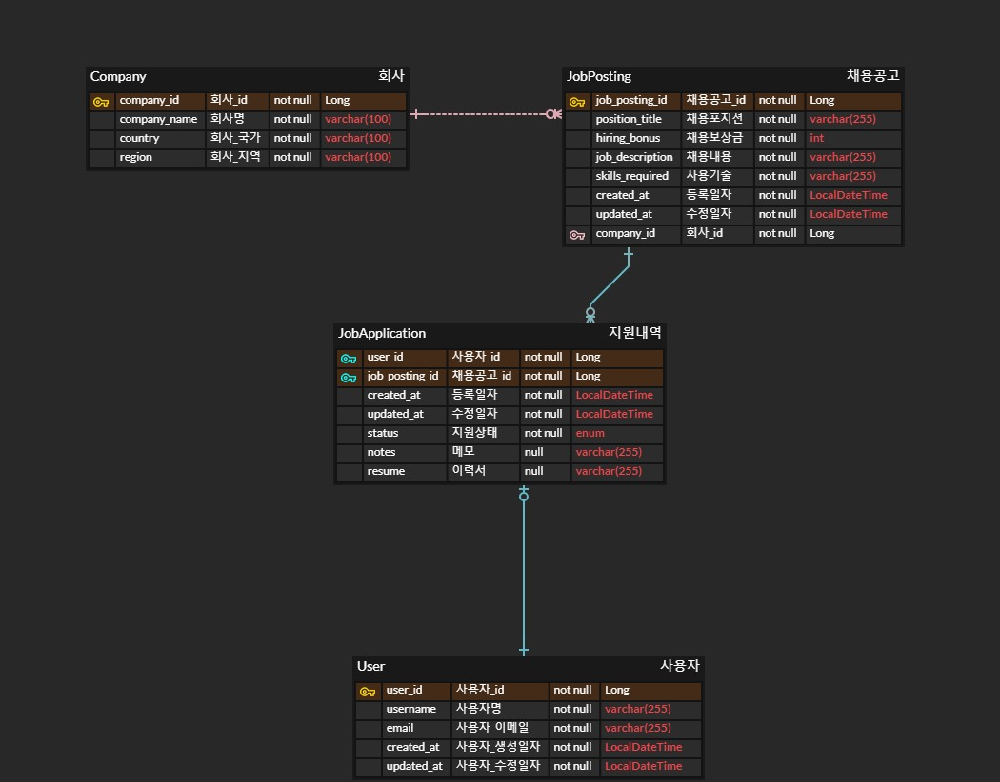

# wanted-pre-onboarding-backend
[프리온보딩 백엔드 인턴십 선발과제](https://bow-hair-db3.notion.site/36ea599aa26e40618f4c1bc4c44f9410)

> Java 21 & Springboot(3.3.2), MySQL
## 서비스 개요
- 본 서비스는 기업의 채용을 위한 웹 서비스입니다.
- 회사는 채용 공고를 생성하고, 이에 사용자는 지원합니다.

## 요구사항
- [x] 필요한 모델: 회사, 사용자, 채용공고, 지원내역(선택사항)
- [x] 채용 공고를 등록합니다. 
- [x] 채용 공고를 수정합니다.
- [x] 채용 공고를 삭제합니다.
- [x] 채용 공고 목록을 가져옵니다.
- [x] 채용 공고 검색 기능 구현(선택사항 및 가산점 요소)
- [x] 채용 상세 페이지를 가져옵니다.
- [ ] 사용자는 채용공고에 지원합니다. (선택사항 및 가산점 요소)
- [x] ORM 사용하여 구현
- [x] RDBMS 사용 (SQLite, PostgreSQL, MySql 등)

---
### 커밋 메시지 포맷
- `feat`: 새로운 기능 추가
- `fix`: 버그 수정
- `docs`: 문서 수정
- `style`: 코드 포맷팅, 세미 콜론 누락 등 코드 자체의 변경이 없는 경우
- `refactor`: 코드 리팩토링
- `test`: 테스트 추가나 수정
- `chore`: 빌드 태스크 업데이트, 패키지 매니저 설정 등 기타 변경

## ERD


### API 명세
| 기능           | api path                               | Http Method |
|--------------|----------------------------------------|------------|
| 1. 채용공고 등록   | /api/job-posting/register              | POST       |
| 2. 채용공고 수정   | /api/job-posting/update/{jobPostingId} | PUT        |
| 3. 채용공고 삭제   | /api/job-posting/delete/{jobPostingId} | DELTE      |
| 4. 채용공고 상세조회 | /api/job-posting/detail/{jobPostingId} | GET        |
| 5. 채용공고 목록 조회 | /api/job-posting/?page=0&size=10       | GET        |
| 6.  채용공고 검색  |/api/job-posting/search?keyword=주니어&page=0&size=10| GET  |


---
- 회사 / 사용자 등록
```sql
INSERT INTO company (company_name, country, region, created_at, updated_at) 
VALUES ('원티드', '한국', '서울', NOW(), NOW());

insert into wanted_user (username, email, created_at, updated_at) 
VALUES ('bsj', 'abc@gmail.com', now(), now());

SELECT * FROM company;
SELECT * FROM job_posting;
```
1. 채용공고 등록(/api/job-posting/register, POST)
```json
// 요청
{
  "companyId": 1,
  "positionTitle":"백엔드 주니어 개발자",
  "hiringBonus":1000000,
  "jobDescription":"원티드랩에서 백엔드 주니어 개발자를 채용합니다. 자격요건은..",
  "skillsRequired":"Python"
}
// 더미데이터용 
{
  "companyId": 1,
  "positionTitle":"초급 DBA",
  "hiringBonus":1200000,
  "jobDescription":"원티드랩에서 초급 DBA를 채용합니다. 자격요건은..",
  "skillsRequired":"Oracle DB"
}

// 응답
"채용 공고 등록이 완료되었습니다."
```


2. 채용공고 수정 (/api/job-posting/update/{jobPostingId})
```json
// 요청 
{
  "positionTitle":"프론트 주니어 개발자",
  "hiringBonus":2500000,
  "jobDescription":"원티드랩에서 프론트 주니어 개발자를 채용합니다. 자격요건은..",
  "skillsRequired":"JS"
}

// 응답
"채용 공고 수정이 완료되었습니다."
```

3. 채용 공고 삭제 (/api/job-posting/delete/{jobPostingId})
```json
// 응답
"채용 공고 삭제가 완료되었습니다."
```

4. 채용 공고 상세 조회 (/api/job-posting/detail/{jobPostingId})
```json
// 응답
{
  "jobPostId": 1,
  "companyId": 1,
  "country": "한국",
  "region": "서울",
  "positionTitle": "백엔드 주니어 개발자",
  "hiringBonus": 1000000,
  "jobDescription": "원티드랩에서 백엔드 주니어 개발자를 채용합니다. 자격요건은..",
  "skillsRequired": "Python",
  "jobPostings": [
    1
  ]
}
```

5. 채용 공고 목록 조회 (/api/job-posting/?page=0&size=10)
```json
// 응답
{
  "content": [
    {
      "jobPostId": 1,
      "companyId": 1,
      "country": "한국",
      "region": "서울",
      "positionTitle": "백엔드 주니어 개발자",
      "hiringBonus": 1000000,
      "skillsRequired": "Python"
    },
    {
      "jobPostId": 2,
      "companyId": 1,
      "country": "한국",
      "region": "서울",
      "positionTitle": "초급 DBA",
      "hiringBonus": 1200000,
      "skillsRequired": "Oracle DB"
    }
  ],
  "pageNumber": 0,
  "pageSize": 10,
  "totalElements": 2,
  "totalPages": 1,
  "last": true
}
```

6. 채용 공고 검색 (api/job-posting/search?keyword=주니어&page=0&size=10)
```json
// 응답
{
  "content": [
    {
      "jobPostId": 1,
      "companyId": 1,
      "country": "한국",
      "region": "서울",
      "positionTitle": "백엔드 주니어 개발자",
      "hiringBonus": 1000000,
      "skillsRequired": "Python"
    }
  ],
  "pageNumber": 0,
  "pageSize": 10,
  "totalElements": 1,
  "totalPages": 1,
  "last": true
}
```

7. 사용자 채용공고 지원
```json
// 요청
{
    "jobPostingId": 1,
    "userId": 1,
    "resume": "https://github.com/bsjin1122/wanted-pre-onboarding-backend"
}
```